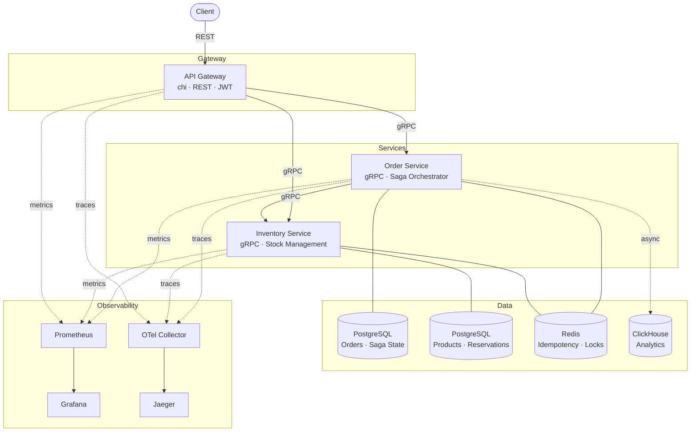
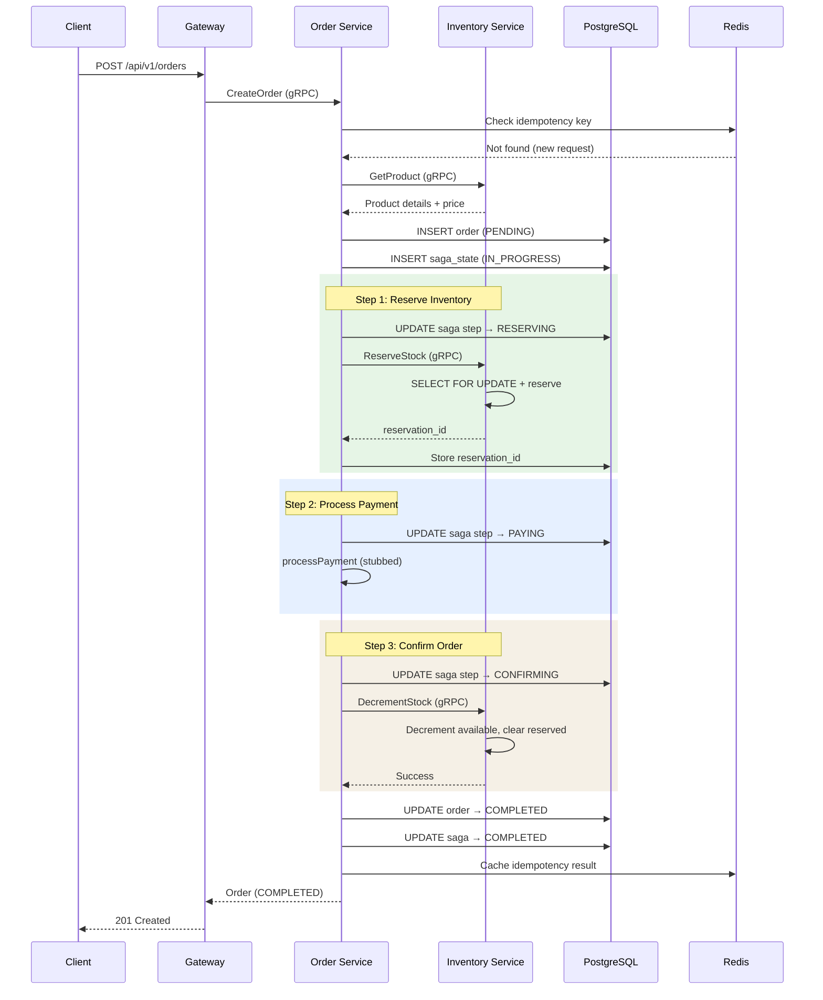
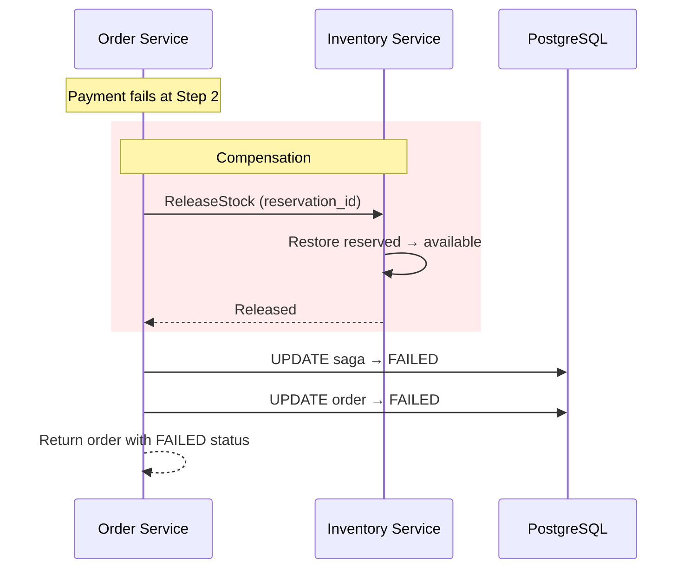

# micromart

## Overview

A production-grade e-commerce order processing backend built as Go microservices. The system demonstrates distributed systems patterns in a real-world domain: an API Gateway receives REST requests from clients and translates them to gRPC calls across an Order Service and Inventory Service. When a customer places an order, the Order Service orchestrates a saga that reserves inventory, processes payment, and confirms the order, with automatic compensation (rollback) if any step fails.

Each service owns its own PostgreSQL database with strict isolation. Redis handles idempotency keys, distributed locking, and rate limiting. Completed orders are streamed asynchronously to ClickHouse for analytics. The entire system is observable via OpenTelemetry traces, Prometheus metrics, and Grafana dashboards.

Built as a learning project to explore microservices architecture, distributed transactions, and infrastructure patterns end-to-end.

## Architecture



## Saga Flow



### Compensation (Payment Failure)



## Documentation

- **[Development Guide](DEVELOPMENT.md)** - Setup, coding, testing, debugging
- **[Contributing Guide](CONTRIBUTING.md)** - How to contribute, PR guidelines
- **[Kubernetes Deployment](deploy/k8s/README.md)** - K8s setup and operations
- **[Architecture Decision Records](docs/adr/)** - Design decisions and rationale

## Tech Stack

| Component | Technology |
|-----------|-----------|
| Language | Go 1.25 |
| HTTP Router | chi |
| Inter-service | gRPC / Protocol Buffers |
| SQL | sqlx + pgx |
| Proto Codegen | buf |
| Migrations | golang-migrate |
| Primary Database | PostgreSQL (per-service) |
| Cache / Locking | Redis |
| Analytics | ClickHouse |
| Tracing | OpenTelemetry + Jaeger |
| Metrics | Prometheus + Grafana |
| Logging | slog (structured JSON) |
| Containers | Docker Compose (local), Kubernetes (prod) |
| CI/CD | GitHub Actions |
| Load Testing | k6 |

## Key Patterns

**Orchestrated Saga** — Order Service coordinates a multi-step transaction (reserve → pay → confirm) with compensating actions on failure. Saga state is persisted in PostgreSQL for crash recovery. See [ADR-001](docs/adr/adr-001-orchestrated-saga.md).

**Idempotency** — CreateOrder accepts an idempotency key. Redis is checked first (fast path), PostgreSQL UNIQUE constraint is the fallback. Duplicate requests return the original order without re-executing the saga.

**Distributed Locking** — Redis-based locks (SET NX EX) prevent concurrent reservations from overselling inventory. SELECT FOR UPDATE provides row-level locking within PostgreSQL transactions.

**Circuit Breaker** — gRPC client interceptor (sony/gobreaker) on Order → Inventory calls. Trips after 5 consecutive transient failures, fails fast for 10 seconds, then enters half-open state. Only transient errors (Unavailable, DeadlineExceeded) count — NotFound and InvalidArgument pass through.

**Retry with Backoff** — Exponential backoff with full jitter on transient gRPC failures. Capped at 10 seconds, max 3 retries. Works with the circuit breaker (retries stop when circuit opens).

**CQRS-lite** — Operational data in PostgreSQL, analytical data in ClickHouse. Completed order events are published asynchronously via a background consumer with batch inserts.

## Getting Started

### Prerequisites

- Go 1.25+
- Docker & Docker Compose
- [buf](https://buf.build/docs/installation)
- [golang-migrate](https://github.com/golang-migrate/migrate) (or use Docker: `migrate/migrate`)
- [k6](https://k6.io/docs/getting-started/installation/) (optional, for load testing)

### Setup

```bash
# Clone
git clone https://github.com/ahargunyllib/micromart.git
cd micromart

# Start infrastructure
make up

# Run database migrations
make migrate-up

# Generate proto code (if gen/ is gitignored)
make proto
```

### Run (Local Development)

Start each service in a separate terminal:

```bash
make run-inventory    # gRPC :50052, metrics :9092
make run-order        # gRPC :50051, metrics :9091
make run-gateway      # HTTP :8080
```

### Deploy to Kubernetes

For production deployments, use Kubernetes manifests in `deploy/k8s/`:

```bash
# Build service images
make build

# Build migration images
make build-migrations

# Deploy everything (namespace, infrastructure, services)
make k8s-apply

# Run database migrations
make k8s-migrate-up

# Check migration status
make k8s-migrate-status

# View migration logs if needed
make k8s-migrate-logs-order
make k8s-migrate-logs-inventory

# Port-forward to access services locally
make k8s-port-forward-gateway      # Access API at localhost:8080
make k8s-port-forward-grafana      # Access Grafana at localhost:3000
make k8s-port-forward-jaeger       # Access Jaeger at localhost:16686
make k8s-port-forward-prometheus   # Access Prometheus at localhost:9090

# View logs
make k8s-logs-gateway
make k8s-logs-order
make k8s-logs-inventory

# Check status of all resources
make k8s-status

# Clean up
make k8s-delete
```

See [deploy/k8s/README.md](deploy/k8s/README.md) for detailed Kubernetes deployment documentation.

### Verify

```bash
# Health check
curl http://localhost:8080/health

# Create a product
curl -X POST http://localhost:8080/api/v1/products \
  -H "Content-Type: application/json" \
  -d '{"name":"Wireless Mouse","category":"electronics","price_cents":2999,"initial_stock":50}'

# Create an order
curl -X POST http://localhost:8080/api/v1/orders \
  -H "Content-Type: application/json" \
  -d '{"customer_id":"billy","items":[{"product_id":"<PRODUCT_ID>","quantity":2}]}'
```

### Observability

| Tool | URL | Purpose |
|------|-----|---------|
| Grafana | http://localhost:3000 | Dashboards (admin/admin) |
| Jaeger | http://localhost:16686 | Distributed traces |
| Prometheus | http://localhost:9090 | Raw metrics |
| ClickHouse | `docker exec -it clickhouse clickhouse-client` | Analytics queries |

### Tests

```bash
# Run all tests
make test

# With coverage report
make test-cover
```

### Load Testing

```bash
# Full load test (5 minutes, ramp to 20 VUs)
make load-test

# Quick smoke test (30 seconds, 5 VUs)
make load-test-quick
```

## Project Structure

```
micromart/
├── proto/                          # Protocol Buffer definitions
│   ├── order/v1/order.proto
│   └── inventory/v1/inventory.proto
├── gen/                            # Generated proto code
├── services/
│   ├── gateway/                    # REST API Gateway
│   │   ├── main.go                 # Entrypoint, routing, middleware
│   │   ├── product_handler.go      # REST → gRPC for products
│   │   ├── order_handler.go        # REST → gRPC for orders
│   │   ├── helpers.go              # JSON utils, gRPC→HTTP error mapping
│   │   ├── types.go                # Request/response structs
│   │   └── Dockerfile
│   ├── order/                      # Order Service
│   │   ├── main.go                 # Entrypoint, wiring
│   │   ├── server.go               # gRPC implementation
│   │   ├── repository.go           # Database queries
│   │   ├── model.go                # Database models
│   │   ├── saga.go                 # Saga orchestrator
│   │   ├── clickhouse.go           # Analytics consumer
│   │   ├── server_test.go          # Integration tests
│   │   └── Dockerfile
│   └── inventory/                  # Inventory & Catalog Service
│       ├── main.go
│       ├── server.go
│       ├── repository.go
│       ├── model.go
│       ├── server_test.go
│       └── Dockerfile
├── pkg/                            # Shared packages
│   ├── config/                     # Environment variable helpers
│   ├── logger/                     # slog with trace ID support
│   ├── grpcutil/                   # Server/client, interceptors, circuit breaker, retry
│   ├── metrics/                    # Prometheus metrics definitions
│   ├── otel/                       # OpenTelemetry initialization
│   └── redis/                      # Redis client (idempotency, distributed locks)
├── migrations/
│   ├── order/                      # Order DB schema
│   └── inventory/                  # Inventory DB schema
├── deploy/
│   ├── k8s/                        # Kubernetes manifests
│   ├── prometheus.yaml             # Prometheus scrape config
│   ├── otelcol.yaml                # OTel Collector config
│   └── grafana-dashboard.json      # Pre-built Grafana dashboard
├── tests/
│   ├── load/
│   │   └── k6.js                   # k6 load test script
├── docs/
│   └── adr/                        # Architecture Decision Records
├── scripts/
│   └── migrate.sh                  # Migration helper
├── .github/
│   └── workflows/ci.yaml           # CI/CD pipeline
├── docker-compose.yaml
├── buf.yaml
├── buf.gen.yaml
├── go.work
├── Makefile
├── .golangci.yaml
├── .gitignore
├── README.md                       # This file
├── DEVELOPMENT.md                  # Development guide
└── CONTRIBUTING.md                 # Contribution guidelines
```

## API Reference

### Products

| Method | Path | Description |
|--------|------|-------------|
| POST | /api/v1/products | Create a product |
| GET | /api/v1/products | List products (query: `category`, `page_size`, `page_token`) |
| GET | /api/v1/products/search | Search products (query: `q`, `page_size`, `page_token`) |
| GET | /api/v1/products/:id | Get product by ID |
| PUT | /api/v1/products/:id | Update product (partial) |

### Orders

| Method | Path | Description |
|--------|------|-------------|
| POST | /api/v1/orders | Create an order (triggers saga) |
| GET | /api/v1/orders | List orders (query: `customer_id`, `page_size`, `page_token`) |
| GET | /api/v1/orders/:id | Get order by ID |
| POST | /api/v1/orders/:id/cancel | Cancel an order |

## Design Decisions

See the [Architecture Decision Records](docs/adr/) for detailed rationale:

- [ADR-001: Orchestrated Saga Pattern](docs/adr/adr-001-orchestrated-saga.md)
- [ADR-002: gRPC for Inter-Service Communication](docs/adr/adr-002-grpc.md)
- [ADR-003: ClickHouse for Analytics](docs/adr/adr-003-clickhouse.md)
- [ADR-004: Monorepo with Go Workspaces](docs/adr/adr-004-monorepo.md)

## Development

See [DEVELOPMENT.md](DEVELOPMENT.md) for detailed development instructions including:
- Setting up your environment
- Working with proto files and migrations
- Code quality and testing
- Debugging and profiling
- Adding new services

## Contributing

We welcome contributions! See [CONTRIBUTING.md](CONTRIBUTING.md) for:
- Contribution workflow
- Code style guidelines
- Testing requirements
- PR guidelines

## License

MIT
